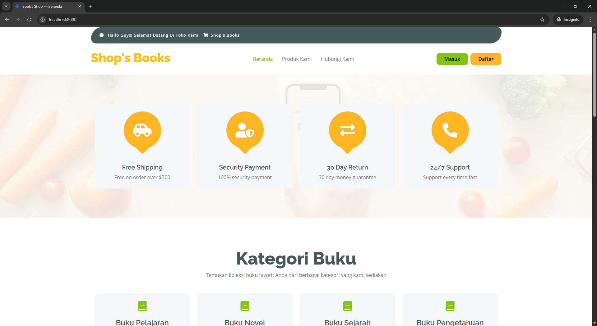
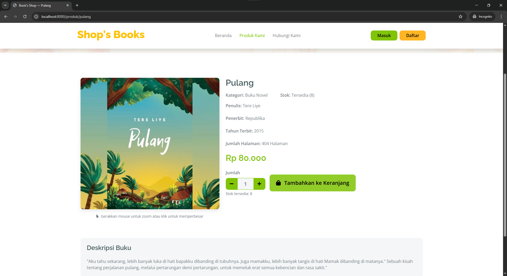
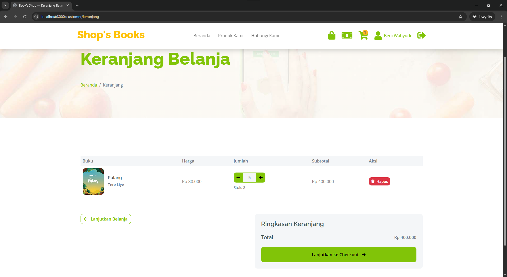
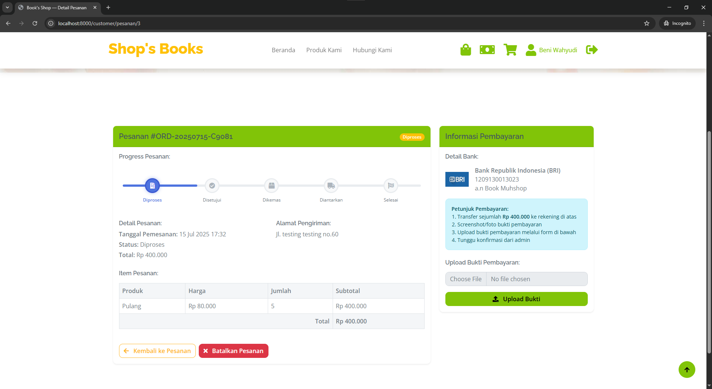
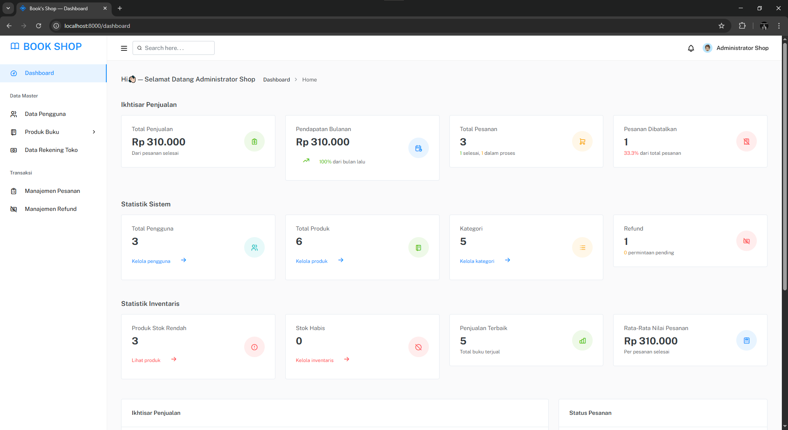
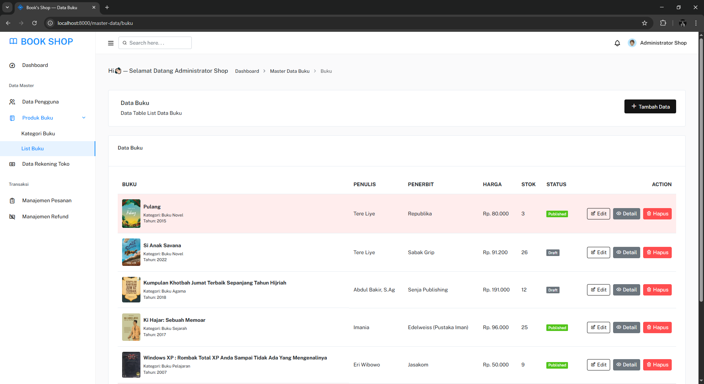
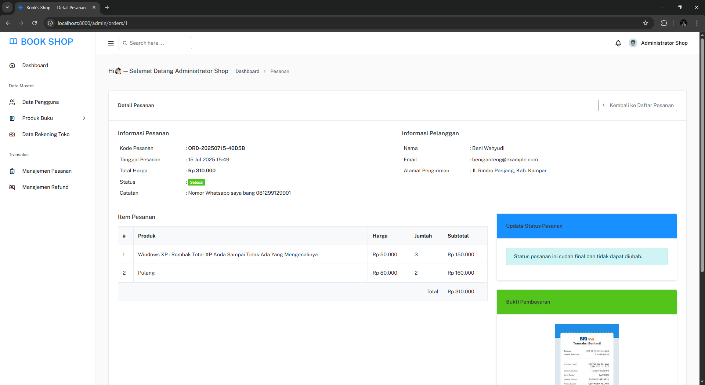
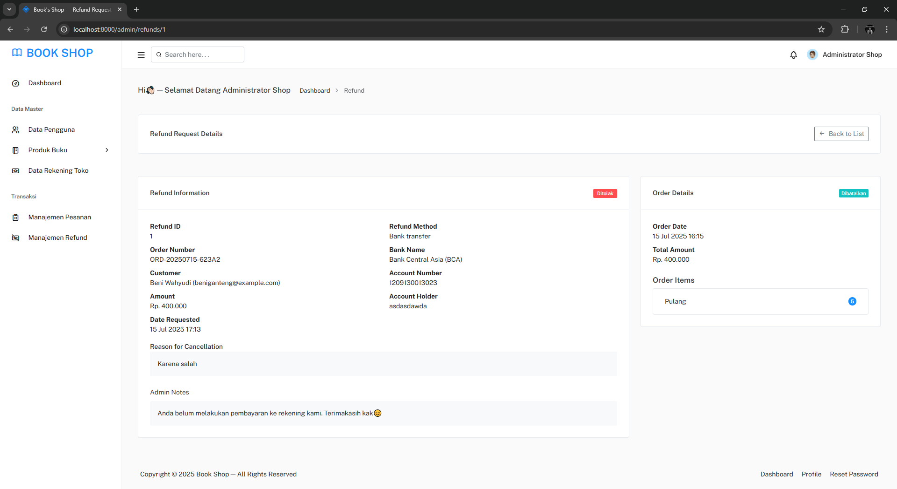

<h1 align="center">Book Shop - Sistem Toko Buku Online</h1>

<p align="center">
  <a href="#fitur">Fitur</a> •
  <a href="#teknologi">Teknologi</a> •
  <a href="#instalasi">Cara Instalasi</a> •
  <a href="#penggunaan">Cara Penggunaan</a> •
  <a href="#struktur">Struktur Proyek</a> •
  <a href="#screenshot">Screenshot</a> •
  <a href="#kontribusi">Kontribusi</a> •
  <a href="#lisensi">Lisensi</a>
</p>

<p align="center">
  Book Shop adalah aplikasi e-commerce toko buku berbasis web yang dibangun dengan framework Laravel. Aplikasi ini menyediakan platform untuk penjualan buku online dengan fitur pengelolaan inventaris, pesanan, pembayaran, dan refund.
</p>

---

<a id="fitur"></a>

## ✨ Fitur Utama

### Customer (Frontend)

-   **Autentikasi Pengguna** - Login, register, reset password
-   **Pencarian & Katalog Produk** - Filter berdasarkan kategori, pencarian, sorting
-   **Keranjang Belanja** - Menambah/menghapus item, update kuantitas
-   **Proses Checkout** - Alamat pengiriman, metode pengiriman
-   **Pembayaran Online** - Upload bukti pembayaran
-   **Pelacakan Pesanan** - Status pesanan dengan timeline
-   **Manajemen Akun** - Update profil, alamat, password
-   **Riwayat Pesanan** - Daftar pesanan, detail pesanan
-   **Sistem Refund** - Permintaan refund, pelacakan status refund

### Admin (Backend)

-   **Dashboard Admin** - Statistik penjualan, pendapatan, pesanan terbaru
-   **Manajemen Produk** - CRUD buku, upload gambar, stok
-   **Manajemen Kategori** - CRUD kategori buku
-   **Manajemen Pesanan** - Lihat, proses, update status pesanan
-   **Manajemen Pembayaran** - Validasi bukti pembayaran
-   **Manajemen Refund** - Proses permintaan refund
-   **Pengaturan Rekening** - Pengaturan rekening pembayaran
-   **Manajemen Pengguna** - CRUD pengguna, pengaturan peran

---

<a id="teknologi"></a>

## 🛠️ Teknologi

### Backend

-   **[Laravel 10](https://laravel.com/)** - Framework PHP
-   **[MySQL](https://mysql.com/)** - Database
-   **[Eloquent ORM](https://laravel.com/docs/eloquent)** - Object-Relational Mapping
-   **[Blade](https://laravel.com/docs/blade)** - Template Engine

### Frontend

-   **[Bootstrap 5](https://getbootstrap.com/)** - Framework CSS
-   **[Font Awesome](https://fontawesome.com/)** - Icon Library
-   **[jQuery](https://jquery.com/)** - JavaScript Library
-   **[SweetAlert2](https://sweetalert2.github.io/)** - JavaScript Popup Boxes

### Tools & Library

-   **[Laragon](https://laragon.org/)** - Development Environment
-   **[Composer](https://getcomposer.org/)** - Dependency Manager
-   **[Git](https://git-scm.com/)** - Version Control

---

<a id="instalasi"></a>

## 🚀 Cara Instalasi

### Prasyarat

-   PHP >= 8.2.\*
-   MySQL >= 8.\*
-   Composer

### Langkah Instalasi

1. **Clone repositori**

```bash
git clone https://github.com/tengkuzainul/market-book.git
cd market-book
```

2. **Install dependensi PHP**

```bash
composer install
```

3. **Siapkan file environment**

```bash
cp .env.example .env
```

4. **Konfigurasi database di file .env**

```
DB_CONNECTION=mysql
DB_HOST=127.0.0.1
DB_PORT=3306
DB_DATABASE=db_book_shop
DB_USERNAME=root
DB_PASSWORD=
```

5. **Jalankan migrasi dan seeder**

```bash
php artisan migrate --seed
```

6. **Jalankan server**

```bash
php artisan serve
```

7. **Akses aplikasi**
   Buka browser dan akses: `http://localhost:8000`

---

<a id="penggunaan"></a>

## 📝 Cara Penggunaan

### Akses Admin

-   URL: `http://localhost:8000/login`
-   Email: admin@shopping.test
-   Password: admin2025

### Akses Customer

-   URL: `http://localhost:8000/login`
-   Email: customer@shopping.test
-   Password: password

### Alur Penggunaan Customer

1. Login atau register akun baru
2. Browse katalog buku
3. Tambahkan buku ke keranjang
4. Lakukan checkout pesanan
5. Upload bukti pembayaran
6. Lacak status pesanan

### Alur Penggunaan Admin

1. Login ke dashboard admin
2. Kelola produk dan kategori
3. Validasi pembayaran pesanan
4. Update status pesanan
5. Proses permintaan refund jika ada

---

<a id="struktur"></a>

## 📂 Struktur Proyek

```
app/
├── Http/
│   ├── Controllers/          # Controller aplikasi
│   ├── Middleware/           # Middleware
│   └── Requests/             # Form requests
├── Models/                   # Model database
│   ├── Buku.php
│   ├── KategoriBuku.php
│   ├── RekeningPembayaran.php
│   └── User.php
├── View/                     # View composers
config/                       # File konfigurasi
database/
├── migrations/               # Database migrations
├── factories/                # Model factories untuk testing
└── seeders/                  # Database seeders
public/                       # Asset publik
├── frontend/                 # Asset frontend
└── image/                    # Gambar produk dan bukti pembayaran
resources/
├── views/                    # Blade templates
│   ├── admin/                # Template admin
│   ├── customer/             # Template customer
│   └── refund/               # Template refund
routes/                       # Definisi rute
└── web.php                   # Rute web
```

---

<a id="screenshot"></a>

## 📸 Screenshot

### Frontend






### Backend






---

<a id="kontribusi"></a>

## 👨‍💻 Kontribusi

Kontribusi dan saran sangat diterima untuk pengembangan aplikasi ini.

1. Fork repositori ini
2. Buat branch fitur baru (`git checkout -b feature/amazing-feature`)
3. Commit perubahan Anda (`git commit -m 'Add some amazing feature'`)
4. Push ke branch (`git push origin feature/amazing-feature`)
5. Buat Pull Request

---

<a id="lisensi"></a>

## 📄 Lisensi

Didistribusikan di bawah lisensi MIT. Lihat [LICENSE](LICENSE) untuk informasi lebih lanjut.

---

<p align="center">Dibuat dengan ❤️ oleh <a href="https://github.com/tengkuzainul">tengkuzainul</a></p>
